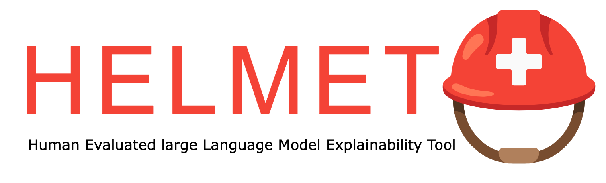

<p align="center">

</p>

<br>

[](https://badge.fury.io/py/helmet)

## Contents
- [Installation helmet](#installation)
- [Local installation helmet-platform](#installation)
- [License](#license)

## Installation

```console
pip install helmet
```

## Configuration files

### Project configuration

```python
project_config = {
    platform_url: "localhost:4000"
}
```

- Model configuration
- Run configuration

## Features

- Load any causal model from Huggingface.
- Create a project for your experiment
- Run experimental prompts

### Insall `helmet` from source

To use helmet in one of the examples perform the following steps:

1. Create venv with `python -m venv .venv`
2. Activate the venv with `source .venv/bin/activate`
3. Install HELMET from source (from git, when located in the home folder of helmet `pip install -e .`
4. Install jupyter notebook `pip install jupyterlab`

To remove:

1. `deactivate`
2. `jupyter-kernelspec uninstall venv`
3. `rm -r venv`

## Running webapp locally

For this, please check the `README` in the webapp

## Credits

Some inspiration has been drawn from a couple of other tools:

- [Interpret-ml](https://github.com/kayoyin/interpret-lm)
- [Ecco](https://github.com/jalammar/ecco)
- [Phoenix](https://github.com/Arize-ai/phoenix)
- [Inseq](https://github.com/inseq-team/inseq)
- [Ferret](https://github.com/g8a9/ferret)

## License

`helmet` is distributed under the terms of the [MIT](https://spdx.org/licenses/MIT.html) license.
